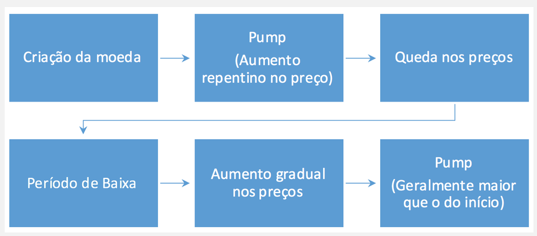

# Metodologia

Com a finalidade de atingir o objetivo proposto desta pesquisa – ou seja, compreender o fluxo especulativo da criptomoeda _Bitcoin_, averiguando em que medida o preço da moeda, negociado durante junho de 2017 foi influenciado por informações a respeito da moeda, como também, por informações sobre conflitos internacionais –, foi realizada uma pesquisa quantitativa exploratória, pois, de acordo com com Piovesan e Temporini \(1995\), a pesquisa exploratória tem como objetivo conhecer o objeto de pesquisa de modo a tentar adequá-lo à realidade que se pretende conhecer na pesquisa, dessa forma, será contextualizado o _Bitcoin_ dentro do mercado financeiro, fazendo um paralelo com a influência do dólar no seu preço, para então averiguar a hipótese deste trabalho, utilizando como ferramenta de análise uma metodologia baseada no estudo de eventos, tal como fizeram Cutler, Porteba e Summers \(1989\), que comprovaram que notícias podem influenciar o preço de ações da bolsa de valores.

Quanto aos procedimentos, esta pesquisa caracteriza-se como experimental pois, assim como colocou Gil \(2008, p. 51\), a pesquisa experimental busca delimitar as variáveis que influenciam o resultado e entender os efeitos dessa influência, situando-se, desta forma, dentro desta tipologia, pois, com a coleta das variáveis – ou seja, as notícias – de mercado é possível identificar se isso influenciou ou não no preço do _bitcoin_.

Quanto à finalidade, essa pesquisa tem natureza aplicada, pois, como a metodologia de estudo de eventos têm viés mais estatístico, foi decidido por acessar algumas etapas desse aporte teórico do estudo de eventos, adaptar os conceitos teóricos e aplicá-los no âmbito do _Bitcoin_, obtendo-se então as etapas a seguir:

1. Definição do evento: com intuito de tornar a pesquisa mais objetiva, utilizaremos o período do mês inteiro de junho/2017, analisando separadamente cada semana.
2. Seleção de critérios: dentro desta pesquisa teremos como foco a criptomoeda _Bitcoin_ \(BTC\), portanto, as análises serão feitas apenas dentro deste contexto, com o preço sempre sendo cotado em dólar americano \(USD\), utilizando cotações do coinmarketcap.com.
3. Retornos normais e anormais: como a finalidade deste trabalho não é estatístico, e sim puramente metodológico-informacional, não utilizaremos modelos estatísticos.
4. Procedimento de estimativa: utilizaremos, neste trabalho, o período de 1 de junho de 2017 até 30 de junho de 2017, e dentro deste recorte, dividiremos a analisaremos separadamente cada semana, com intuito de obter resultados mais relevantes.
5. Procedimento de Teste: por opção metodológica, nosso parâmetro para testes serão dois pilares, o primeiro será uma comparação com o ano anterior, a segundo pilar será uma comparação com a metodologia desenvolvida neste trabalho.
6. Resultados empíricos: Os resultados obtidos serão apresentados em forma de gráficos, utilizando cotações no par _Bitcoin_/Dólar americano \(BTC/USD\).
7. Interpretação e conclusões: Nesta etapa poderemos concluir em que medida as notícias influenciaram no preço do _Bitcoin_ no período destacado.

Tendo em vista a globalização do _Bitcoin_, utilizou-se a ferramenta de busca de notícias do Google, juntamente com o seu filtro de pesquisa avançado para obter notícias que envolvam a comunidade internacional ou de grande comoção internacional, com o pressuposto de que estas notícias influenciaram diretamente, ocasionando picos de preços anormais durante o mês de junho de 2017. O campo de assunto foi limitado às temáticas de política, economia e tecnologia. Esse filtro teve como objetivo selecionar notícias que realmente podem impactar no mercado do _Bitcoin_.

Durante a elaboração desta análise interpretativa do estudo de eventos, foi percebido que o _Bitcoin_ dificilmente se encaixaria completamente na metodologia do estudo de eventos. O El País \(2017\) publicou uma matéria que esclarece as grandes diferenças teóricas e práticas entre as moedas fiduciárias e as moedas digitais, tal como _bitcoin_. Ficou evidenciado que ainda é cedo demais para estabelecer indicadores como retornos normais e anormais, devido à incrível variação diária do _bitcoin_. Ficou decidido então, agregar à este trabalho o conhecimento empírico de um grande player \(_trader_\) do mercado de _Bitcoin_, que solicitou que sua identidade não seja revelada. Durante a entrevista, realizada informalmente via skype, este _trader,_ que realiza diariamente transações envolvendo criptomoedas, confirmou o que já havia observado na matéria, ressaltando que grande parte das criptomoedas passam pelo mesmo ciclo de vida, que foi representado no fluxograma a seguir:

Esses acontecimentos mostraram a necessidade de adaptar a metodologia de estudo de eventos ao mercado das criptomoedas, pois, o cenário do mercado de ações ainda está distante do ecossistema das criptomoedas, principalmente por causa da rapidez em que os acontecimentos no mercado de criptomoedas ocorrem em relação ao mercado financeiro convencional, explicado na sessão de fluxo especulativo.

O estudo de eventos seguirá sendo utilizado como embasamento teórico, porém, com base nas informações obtidas, foram mescladas algumas etapas, resultando em uma interpretação do estudo de eventos diferente da convencional, como é possível ver na imagem abaixo:

1. A análise do preço: durante esta etapa, utilizando conceitos das etapas 1 e 2 da metodologia do Estudo de Eventos, foram mescladas as etapas de definição do evento, que neste caso será o período de avaliação do preço e a seleção de critérios, utilizando o histórico de preço na semana, e comparando com o preço do dólar no mesmo dia.
2. Mapeamento da especulação: para mapear o fluxo, foi preciso cruzar os dados de eventos relacionados ao _Bitcoin_, sejam eles reuniões, encontros, palestras ou até mesmo ataques hackers. Com esse cruzamento de dados, é possível obter informações estratégicas para compreender a tendência de preço do _Bitcoin_, e entender o que os traders, isto é, as pessoas que fazem negociação com _Bitcoins_, estão pensando acerca do preço da moeda no momento. Esta etapa não está explicitamente exposta no estudo de eventos, contudo, é interessante colocá-la aqui com a finalidade de entender de onde vêm o fluxo de notícias e com que intensidade.
3. Estimativa de variação: baseando-se na etapa 4, de procedimento de estimativa, utilizando as informações obtidas na etapa anterior de mapeamento da especulação, é necessário comparar as variações obtidas com outros períodos de semanas anteriores. Essa comparação resultará num parâmetro para entender se a variação que está ocorrendo é fruto do processo natural de compra/venda ou é fruto de especulação. A partir das informações obtidas na entrevista com o trader, foi possível chegar à conclusão que normalmente, quando o movimento de queda/subida é natural, a tendência é linear e suave, seguindo o padrão de 3 à 5% ao dia. Quando o preço sofre influência externa de especulação, demora cerca de 4 horas para que isso seja refletido no preço, porém, esse tempo pode ser menor dependendo do impacto global da notícia \(ex.: ameaça de guerra, o reflexo é quase instantâneo\).
4. Apresentação dos resultados: assim como as etapas 6 e 7 determinam, os resultados das etapas anteriores precisam ser compilados de uma forma agradável visualmente, de forma que se possa facilmente inferir se o preço sofreu influência de eventos externos ou não. Os resultados apresentados serão gráficos extraídos dos site Investing.com, com suas respectivas variações diárias, colorido de forma que possa se identificar o tipo de variação \(positiva ou negativa\) e as máximas e mínimas da semana.

No que se refere a fontes de informação para cotação do preço _Bitcoin_, foram utilizados os sites CoinMarketCap e Investing. Outros sites confiáveis que oferecem cotações em tempo real de criptomoedas são:

* CrytoWatch
* BitcoinCharts
* CryptoCompare

