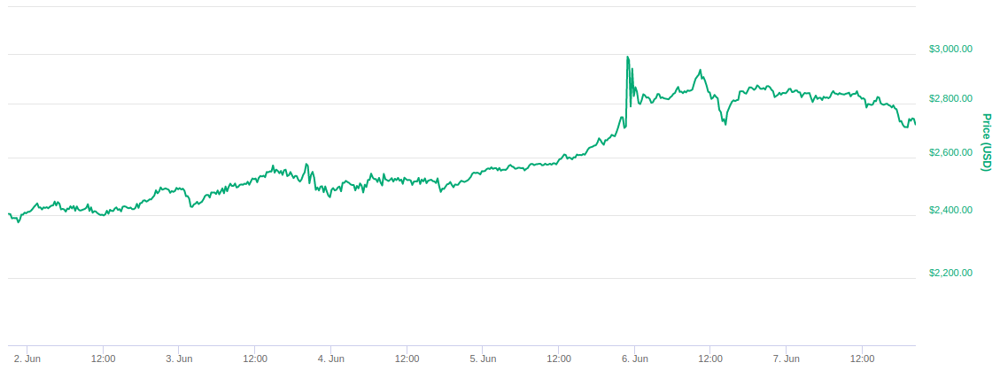
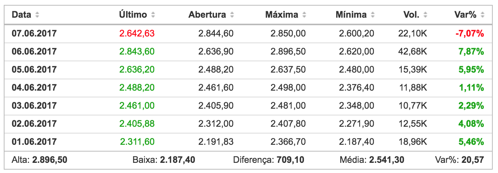
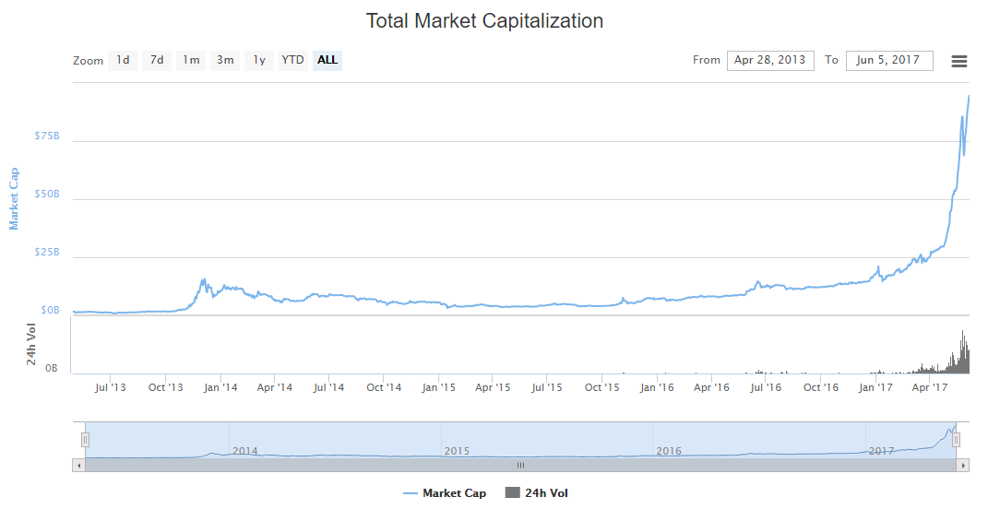
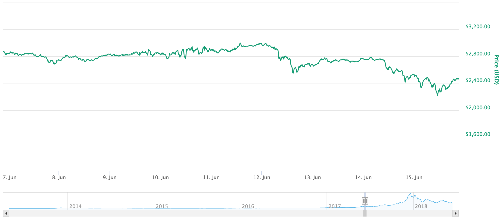
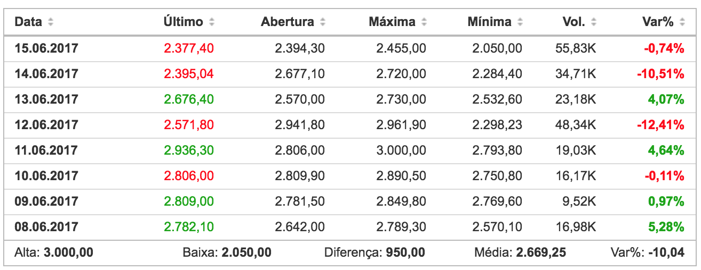
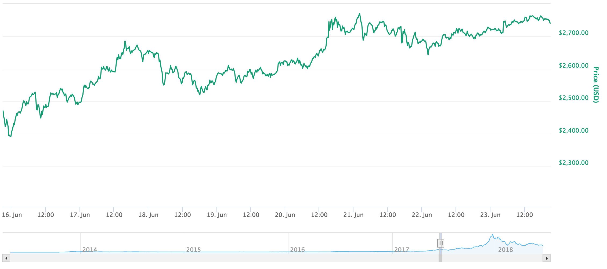
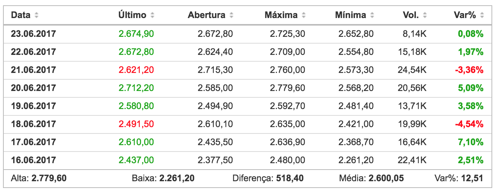
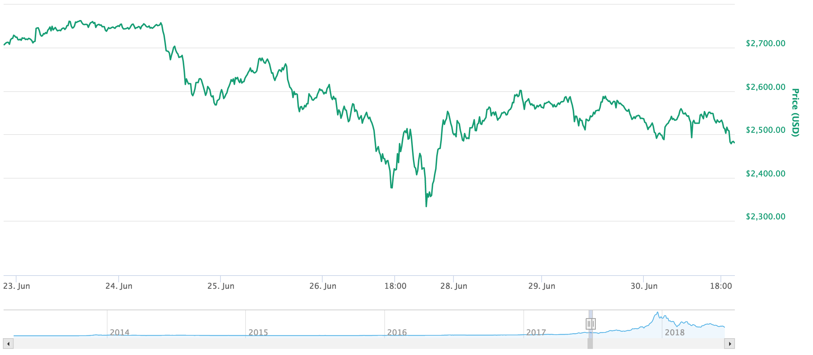

# Resultados

## Índice

1. [Primeira semana de junho/2017](4.resultados.md#primeira)
2. [Segunda semana de junho/2017](4.resultados.md#segunda)
3. [Terceira semana de junho/2017](4.resultados.md#terceira)
4. [Quarta semana de junho/2017](4.resultados.md#quarta)

Buscando auxiliar a compreensão dessa análise, ficou decidido que analisar semanalmente o preço do _Bitcoin_ durante o mês de junho/2017 poderia aproximar os resultados da realidade, pois. com um cenário de recorte maior, o preço sofreria influência de muitas fontes de informação e o cenário estaria envolvido em muitos contextos. O mês de junho de 2017 foi o escolhido por ser um mês onde o _Bitcoin_ quebrou vários recordes, seja de preço ou de capitalização de mercado, e houve uma variação expressiva no preço. O mês foi dividido em 4 períodos de observação, sendo eles: a primeira semana, entre 1 e 7 de junho; a segunda semana, entre 8 e 15 de junho; a terceira semana, entre 16 e 23 de junho e a última semana, entre 24 e 31 de junho.

## [Análise de preço na primeira semana de junho/2017](4.resultados.md)

Para ajudar na compreensão dessa análise, iremos analisar semanalmente o preço do Bitcoin durante o mês de junho/2017. Durante a primeira semana \(01/06 até 07/06\), tivemos um aumento no preço de 13,17%, iniciando a semana em 2,404.03 dólares e finalizando em 2,720.49 doláres. Em relação à variação máxima na semana, tivemos uma mínima de 2,375.87 dólares e uma máxima de 2,987.85 dólares, obtendo uma variação de 25,76%. Todos os dados acima podem ser consultados no CoinMarketCap. Confira abaixo o gráfico representativo dessa semana.

Partindo para o mapeamento da especulação, durante esta semana, aconteceram algumas tensões internacionais, iniciando com a saída dos Estados Unidos da América \(EUA\) saindo do acordo de Paris, acordo que prevê que “os países devem trabalhar para que o aquecimento fique muito abaixo de 2ºC, buscando limitá-lo a 1,5ºC em relação aos níveis pré-industriais” \(G1, 2017\). Utilizando as cotações do Investing.com, é possível observar que o preço dólar, em relação ao Euro, caiu 0,63% nesse curto período. Durante o mesmo período, o _Bitcoin_ apresentou um aumento no seu preço, em relação ao dólar, de 5,46%. Essa comparação, como definido anteriormente, é a etapa de estimativa de variação.

O _Bitcoin_ por ser uma moeda que não tem vínculo com governos, acaba que por se sobressair em tensões internacionais deste tipo, atraindo investidores que buscam preservar o seu patrimônio em caso de queda nos preços das moedas tradicionais. No mesmo dia desse impasse político envolvendo os EUA e o acordo de Paris, o CEO da XBT Providers, uma das maiores exchanges de criptomoedas atualmente, publicou uma análise cravando que o _Bitcoin_ chegaria aos 4,000 dólares ainda ao final daquele ano \(CNBC, 2017\). O resultado disso, como se pode observar é uma tendência crescente no preço do _Bitcoin_ nos cinco dias posteriores. Os valores do _bitcoin_ neste período são apresentados na figura a seguir.

Segundo dados do CoinMarketCap, em 5 de junho de 2017 a capitalização de mercado do _Bitcoin_ quebrou seu limite anterior e atingiu a estrondosa marca de 100 bilhões de dólares, como se pode observar no gráfico 6 a capitalização disparou nos anos de 2016 e 2017, justificando a alta procura pela moeda. Apresentando novos horizontes ao _Bitcoin_, que agora já pode ser comparado à outros ativos de maior respaldo no mercado financeiro, segundo a StartSe \(2017\), o _Bitcoin_ chegou a valer mais do que a startup Uber. A figura abaixo apresenta a subida de preço do _bitcoin_ desde 2013 até a semana 1.

## [Análise de preço na segunda semana de junho/2017](4.resultados.md)

Durante a segunda semana \(08/06 até 15/06\), tivemos um decréscimo no preço de 10,02%, iniciando a semana em 2,642.00 dólares e finalizando em 2,377.40 doláres. Em relação à variação máxima na semana, tivemos uma mínima de 2,050.00 dólares e uma máxima de 3,000.00 dólares, obtendo uma variação de 31,67%. Todos os dados acima podem ser consultados no CoinMarketCap. Confira abaixo o gráfico representativo dessa semana.

Esta segunda semana foi bastante movimentada para o _Bitcoin_, se por um lado despertou a atenção de vários especialistas ao atingir novamente o topo histórico, chegando a ser negociado por 3,000 dólares, porém, dias depois, ao final da semana cada unidade de _Bitcoin_ estava sendo negociada por 2,050 dólares, despencando 31,67%. Essa variação confundiu alguns analistas, pois, a direção que o preço do _Bitcoin_ tomou contrariou as expectativas, confirmando a tendência de queda ao final da semana, tendo uma variação de -10,51% somente no dia 14. A figura a seguir mostra um resumo semanal do _Bitcoin_.

A figura abaixo apresenta a variação dos preços do _bitcoin_ na semana 2.

Esta semana mostrou-se mais calma no cenário político internacional em relação à primeira semana, porém, tivemos muito mais "rallys", isto é: muitas variações \(sobe e desce, informalmente falando\), no preço do _Bitcoin_. Estes rallys aconteceram por conta das altas sucessivas do _Bitcoin_, que gerou um movimento de venda, ocasionado pela mentalidade de lucro rápido dos investidores de criptomoedas.

Este curto período também foi marcado por alguns portais de notícias famosos postando sobre _Bitcoin_, pois, ao chegar aos 3,000 dólares, a criptomoeda triplicou o seu valor no início do ano, que era de 966.58 dólares, segundo informações do CoinMarketCap.

## [Análise de preço na terceira semana de junho/2017](4.resultados.md)

Durante a terceira semana \(16/06 até 23/06\), tivemos um aumento no preço de 11,57%, iniciando a semana em 2,377.50 dólares e finalizando em 2,652.80 doláres. Em relação à variação máxima na semana, tivemos uma mínima de 2,261.20 dólares e uma máxima de 2,779.60 dólares, obtendo uma variação de 22,92%. Todos os dados acima podem ser consultados no CoinMarketCap. Confira abaixo o gráfico representativo dessa semana. O gráfico 6 apresenta a variação na semana 3.

A terceira semana de junho começou agitada em relação à política internacional. Ao final da semana anterior, aconteceram algumas manifestações LGBT, pedindo respeito e mais visibilidade e isso continuou nesta semana, porém, no dia 17, começaram a circular notícias que a Coréia do Norte teria envolvimento na criação e distribuição do vírus de computador do tipo ransomware chamado WannaCry. Segundo reportagem da BBC \(2017\), o ataque ocorreu por causa das recentes e constantes pressões da comunidade internacional sobre a Coréia do Norte a respeito do seu programa nuclear.

De forma resumida, um ransomware é um tipo de vírus de computador que criptografa todos os dados da vítima, e em sua maioria, só liberam o acesso aos documentos mediante pagamento em criptomoedas, geralmente _Bitcoin_. Desta forma, o mercado reagiu rapidamente, pois, este acontecimento serviu como marketing negativo para a moeda, alimentando alguns ferozes críticos do _Bitcoin_ que justificavam seu ódio com argumentos de que a moeda servia apenas para fins ilegais, citando como exemplo o presidente da Coréia do Sul, em discurso no dia 30 de novembro de 2017 \(GUIA DO BITCOIN, 2017\). Após essa culpabilização da Coréia do Norte por parte da imprensa inglesa, o preço do _Bitcoin_ caiu 4,54% no dia seguinte \(18/06\), retomando o mesmo patamar de preço apenas 3 dias depois, como é possível observar no gráfico abaixo. O gráfico 7 apresenta o resumo da variação de preços no _bitcoin_ na semana 3.

Com o gráfico acima, é possível inferir que a terceira semana foi exatamente o inverso da segunda. Como foi observado, houveram graves acusações no cenário internacional, e o início das discussões acerca do Brexit. No âmbito do _Bitcoin_, as movimentações no que dizem respeito ao preço foram pequenas, nenhuma ultrapassou os 10%, e ainda tivemos uma valorização de 11,57% no preço da moeda.

## [Análise de preço na quarta semana de junho/2017](4.resultados.md)

A quarta semana \(24/06 até 30/06\) foi a mais negativa do mês, tivemos um queda no preço de 9,51%, iniciando a semana em 2,674.90 dólares e finalizando em 2,420.70 doláres. Em relação à variação máxima na semana, tivemos uma mínima de 2,208.10 dólares e uma máxima de 2,700.00 dólares, obtendo uma variação de 22,27%. Todos os dados acima podem ser consultados no CoinMarketCap. Confira abaixo o gráfico representativo dessa semana. O Gráfico 8 apresenta a variação do preço na semana 4.

A última semana do mês não teve tantas notícias relacionadas ao _Bitcoin_, exceto um acontecimento importante para a comunidade de criptomoedas, que foi a prisão de Anthony Murgio, que operava uma exchange \(casa de câmbio\) ilegal nos Estados Unidos. O mercado de criptomoedas nesta semana sofreu com uma forte queda, resultante da queda do preço do _Bitcoin_, pois, embora sejam moedas com equipes, estrutura e propósitos diferentes, para alguém conseguir negociar qualquer uma dessas moedas alternativas precisa \(ou pelo menos precisava, à época\) primeiramente trocar seus dólares por Bitcoin.

No cenário político-internacional, tivemos mais um ataque de vírus do tipo ransomware, foi a vez do "Petya", que tem arquitetura parecida com o "WannaCry", porém é mais sofisticado. Assim como seu antecessor, o Petya também exigia pagamento em criptomoedas. Desta forma, o mercado novamente reagiu negativamente, pois, certamente alguns investidores temeram ter suas reputações atreladas à atividade ilegal de hackers. O ataque aconteceu nos dias 27 e 28 de junho, provocando a continuação da tendência negativa no preço do _Bitcoin_, como é possível ver abaixo no resumo semanal. O resumo do preço do _bitcoin_ na semana 4 é apresentada no gráfico 9.

É possível inferir então, que essa semana foi uma das piores do ano para o _Bitcoin_, porém, ainda sim, a criptomoeda encontrava-se com seu valor duplicado em relação ao início do ano. As consequências do ataque do Petya só refletiram apenas nos dias seguintes, com desvalorizações consecutivas.

