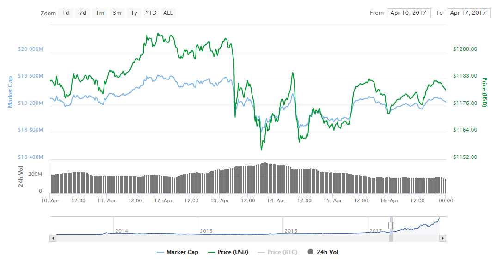
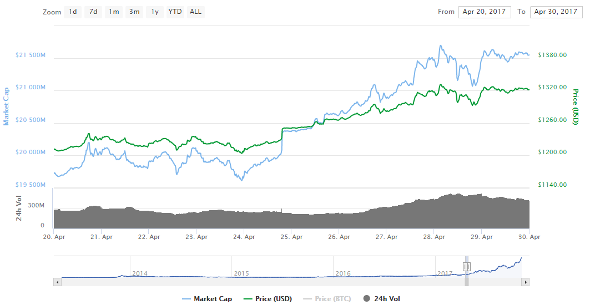

# <a name="fundamentacao">FUNDAMENTAÇÃO TEÓRICA</a>

## Índice

1. [Bitcoin](#bitcoin)
1. [Fluxo Especulativo](#fluxos)
1. [Estudo de Eventos](#eventos)
1. [Tomada de Decisão](#decisao)

Considerando a escassez de materiais relacionados ao tema desta pesquisa, principalmente na área de Gestão da Informação, temos como objetivo um caráter exploratório buscando um melhor entendimento do conjunto de conhecimento acerca das criptomoedas em outras áreas de conhecimento, de maneira a aplicar conceitos estatísticos e econômicos para tomar decisão. De acordo com Piovesan e Temporini (1995), a pesquisa exploratória tem como objetivo conhecer o objeto de pesquisa de modo a tentar adequá-lo à realidade que se pretende conhecer na pesquisa, dessa forma, tentaremos entender como funciona o Bitcoin, e como é possível aplicar as mesmas metodologias utilizadas no mercado de câmbio de moedas estrangeiras para compor uma árvore de tomada de decisão de um robô de investimentos.

Explica-se, dessa forma, a natureza da atual pesquisa, pois, conforme colocou Roll-Hansen (2009), a pesquisa aplicada acessa parte da teoria, porém, sempre buscando coletar novos métodos para executar a teoria, ou seja, estamos visando adquirir novos conhecimentos em um assunto que é predominantemente da área de tecnologia, combinando conceitos das áreas de economia e administração e aplicando técnicas da área de redes neurais e estatística.
Quanto aos procedimentos, esta pesquisa caracteriza-se como experimental pois, assim como colocou Gil (2008, p. 51), a pesquisa experimental busca delimitar as variáveis que influenciam o resultado e entender os efeitos dessa influência, desta forma podemos nos situar dentro desta tipologia, pois, com a coleta das variáveis de mercado será possível identificar e testar os melhores indicadores para automatizar investimentos.

## <a name="bitcoin">BITCOIN</a>

Segundo Aranha Filho (1995), os movimentos migratórios das massas para o mundo digital promoveram diversos impasses sociais que já existiam no mundo físico e foram transferidos para o meio digital. Segundo o autor, ainda naquela época, os provedores de serviços de rede e empresas interessadas em fazer negócio em âmbito digital travavam um verdadeiro duelo por território e delimitações de “fronteiras”.

Esse duelo gerou uma “revolução”, grandes comunidades delimitadas por assuntos específicos foram criadas e mesmo boa parte das pessoas dessas comunidades sendo de países diferentes, a distância não impediu a interação dessas comunidades virtuais e a frequência com que trocavam informação e experiências. De acordo com Silvestri (1993) apud Castells (2005, ed. 8, p. 69), “o que caracteriza a atual revolução tecnológica não é a centralidade de conhecimentos e informações, mas a aplicação desses conhecimentos para a geração de conhecimentos [...] em um ciclo de realimentação cumulativo entre a inovação e seu uso”.

Assim como as comunidades virtuais cresciam, a necessidades de executar tarefas do mundo real em ambiente digital também crescia, e um dos primeiros indícios do que se tornaria a internet foi a popularização do comércio eletrônico, que mesmo sofrendo com fraudes e ataques de hackers constantemente segue numa crescente de adeptos desde o início do século XXI. Era necessário então, um novo paradigma de transações que fosse confiável para as duas partes. Para Nakamoto (2008, tradução nossa),
  > o comércio na Internet tornou-se quase que exclusivamente constituído por instituições financeiras servindo como intermediários confiáveis para processar pagamentos eletrônicos. Enquanto o sistema funciona bem o suficiente para a maioria das transações, ele sofre da fraqueza inerente do modelo baseado em confiança. 

Em seguida, o autor justifica a fragilidade do atual sistema de pagamento, pontuando que nesse sistema, por haver intermediários é necessário a existência de taxas de mediação, elevando os custos de cada transação, assim como acontece em compras com cartão de crédito e débito, e possibilitando que a transação seja interceptada e fraudada ou revertida. Já num sistema de pagamento ponto-a-ponto, Bitcoin, as mesmas transações seriam computacionalmente impraticáveis, diminuindo o riscos de fraude e tornando muito mais rápidas as negociações digitais (NAKAMOTO, 2008).

O Bitcoin foi definido por Nakamoto (2008) como a “versão puramente ponto-a-ponto de dinheiro eletrônico”, ou seja, uma alternativa para o atual sistema monetário com o atrativo de não necessitar de nenhuma entidade centralizadora para validar suas transações. Isso é viável por causa da base técnica do Bitcoin, que em vez de transações baseadas em confiança (protocolos e ambientes seguros) necessita de provas criptográficas para que as duas partes negociadoras possam realizar uma transação diretamente sem uma terceira parte confiável intermediando a negociação.

Atualmente o _Bitcoin_ está sendo usado como reserva de valor, contrariando seu intuito inicial - de ser uma moeda de troca. Ou seja, em vez dos detentores de valores em _Bitcoin_ utilizarem as moedas para trocas e negociações, eles estão "guardando" a moeda, com a esperança que o preço suba de maneira a obter lucro na realização da venda da moeda. De certo modo, esses investidores podem alcançar um lucro anormal para os padrões do mercado financeiro, visto que, durante o ano de 2017 o _Bitcoin_ valorizou 1.420,88%, segundo dados do CoinMarketCap.Essa valorização anormal é um dos principais fatores que atraem novos investidores para esse ativo.

O preço do Bitcoin é fruto da sua oferta e demanda, e como tem passado por sucessivas valorizações, tornou-se um ativo financeiro que tem despertado investidores pelo mundo todo. Ulrich (2014) nos explica a lógica inflacionária do preço do Bitcoin da seguinte forma,
  > a oferta crescerá de forma paulatina, pré-estabelecida e conhecida por todos os usuários até alcançar o limite máximo de 21 milhões de unidades ao redor do ano de 2140 [...] Assumindo que a demanda por bitcoins continue crescendo ao longo dos próximos anos, isso significaria que uma unidade bitcoin valeria cada vez mais. E quanto mais se amplie a aceitação da moeda, maior será seu poder de compra.

[voltar para o topo ↑](#fundamentacao)
[voltar para o sumário ↑](https://github.com/eliabejr/bitcoin-price-analysis/blob/master/portuguese/README.md#sumario)

## <a name="eventos">ESTUDO DE EVENTOS</a>

Segundo Campbell et al. (1997), a utilidade do estudo de eventos está atrelada ao fato de que, dada um determinado contexto dentro do mercado, o efeito de um evento, será refletido imediatamente nos preços dos ativos. O autor observou que o impacto econômico do evento pode ser mensurado utilizando os preços dos ativos observados durante um curto período de tempo, isto é, a reação instantânea do mercado após a disseminação deste evento. Dado isso, estes mesmo autores estabeleceram 7 passos para delinear o estudo de um evento, são eles:

1. Definição do evento: É o passo inicial, definição do evento e do período onde os preços serão analisados.
1. Seleção de critérios: Após definir o evento, é necessário definir os critérios de avaliação, como por exemplo o mercado, abordar apenas eventos de uma determinada fonte, etc.
1. Retornos normais e anormais: Para avaliar, precisamos mensurar. Nesta etapa metrificamos os impactos dos eventos e mensuramos seus retornos, determinando se são normais ou anormais.
1. Procedimento de estimativa: Nesta etapa selecionamos um modelo de desempenho, após isso, os parâmetros do modelo devem ser estimados usando a janela de estimativa.
1. Procedimento de Teste: Com o parâmetro de desempenho estabelecido na etapa passada, é necessário avançar ao teste dos retornos anormais.
1. Resultados empíricos: Nesta etapa ocorre a apresentação dos resultados, pautando-se na estrutura tradicional do design econométrico.
1. Interpretação e conclusões: Os resultados apresentados devem nos levar à interpretações teóricas acerca de como os eventos podem afetar os preços de ações.

A escolha por esta abordagem pauta-se na estrutura teórica desenvolvida em torno desta linha de pensamento, que advém desde o final da década de 60, desenvolvido por Eugene Fama, Lawrence Fisher, Michael Jensen e Richard Roll. Segundo o estudo destes autores, foi possível identificar que sucessivas variações de preços aconteciam por interferências informacionais externas (Fama et al., 1969).

Dentro do contexto brasileiro, o estudo de eventos já foi utilizado para diversas abordagens, desde uma análise empírica do impacto da adesão aos níveis diferenciados de governança corporativa da Bovespa (COSTA
e CAMARGOS, 2006), até um estudo de precificação das ações da Petrobrás durante o caso Pasadena (LEITE, WILBERT e SERRANO, 2016).

Rostagno et al. (2002) sugere que o estudo de eventos trata-se de uma metodologia analítica para metrificar a influência que determinado evento sobre a performance de uma empresa através da investigação dos efeitos de tais eventos nos valores de mercado dos títulos das empresas. Desta forma, é possível mapear a enorme quantidade de informações que ronda o mercado financeiro e consequentemente, o mercado de criptomoedas. Num mercado amplamente globalizado como o de criptomoedas, identificar fatores que possam influenciar no preço dos ativos é, sem dúvidas, uma vantagem estratégica, pois, conforme veremos posteriormente, o preço do _Bitcoin_ oscila de forma "incontrolável" à primeira vista, porém, é possível prever certos movimentos com o uso das técnicas adequadas.

[voltar para o topo ↑](#fundamentacao)
[voltar para o sumário ↑](https://github.com/eliabejr/bitcoin-price-analysis/blob/master/portuguese/README.md#sumario)

## <a name="fluxos">FLUXO ESPECULATIVO</a>

Para contextualizar o processo especulativo no preço do Bitcoin, precisamos conceituar os Fluxos Informacionais. Já que estes possuem diversas definições dentro da Ciência da Informação, iremos utilizar o conceito de que um Fluxo Informacional é um processo de entrada, processamento e saída,  que nos retorna um produto informacional com uso estratégico. Um Fluxo Informacional geralmente é mapeado para identificar carências ou problemas na execução de processos. 

Cada vez mais, a Gestão da Informação (GI) vem sendo percebida como diferencial estratégico nas organizações, essa tendência se tornou uma realidade por conta dos benefícios que um bom planejamento pode ter. Gerir a informação é visualizar a organização de forma holística, com apoio de fluxos informacionais é possível identificar tendências e adotar estratégias para contornar possíveis obstáculos. Corroborando com isto, McGee E Prusak (1994, p.5) afirmam que “a criação, captação, organização, distribuição, interpretação e comercialização da informação são processos essenciais para organizações preocupadas com a GI”.

Utilizando este conceito de fluxos informacionais, e seguindo a linha de raciocínio da técnica de estudo de eventos, será possível entender como os eventos externos influem no preço do _Bitcoin_. Para exemplificar esta aplicação na prática, podemos usar como exemplo a ameaça de guerra entre Estados Unidos da América e Coréia do Norte, em abril de 2017. É possível observar abaixo no gráfico de preço do Bitcoin do mês de abril de 2017, quando a tensão tomou conta da comunidade internacional por causa dos testes de mísseis nucleares por parte da Coréia do Norte, que o preço do _Bitcoin_ flutua de acordo com as notícias.

**Gráfico 1** – Preço do Bitcoin entre 10 e 17 de abril de 2017.

#### Fonte: CoinMarketCap.

Como foi possível observar, entre os dias 10 e 12, houve uma pequena valorização, provavelmente causada pela ameaça do ditador coreano Kim Jong-un de bombardear os Estados Unidos (CNBC, 2017). A queda do preço logo em seguida pode ser explicada por causa da empolgação momentânea da valorização do Bitcoin, provocando um movimento vendedor maior que o de compra, consequentemente causando uma queda no preço.

Ao final do mês, o preço sobe novamente, mais precisamente a partir do dia 24. Essa valorização também pode ser explicada pela tensão internacional entre Estados Unidos e Coréia do Norte. Na manhã do dia 23 de abril de 2017 começaram a circular algumas notícias mencionando que o ditador coreano, Kim Jong-un, teria ameaçado bombardear um porta-aviões americano (CBC, 2017). No Gráfico 2 podemos observar o preço do dólar no par USD/BRL na última semana de abril de 2017.

**Gráfico 2** – Preço do USD/BRL entre 20 e 30 de abril de 2017.

#### Fonte: UOL Economia.

Em seguida, se compararmos com o gráfico do preço do Bitcoin em dólar no mesmo período (Gráfico 3) veremos uma tendência inversa à valorização do dólar, ou seja, enquanto o dólar valorizou apenas 0,79%, o Bitcoin valorizou 9,08% no mesmo período.

**Gráfico 3** – Preço do Bitcoin entre 20 e 30 de abril de 2017.

#### Fonte: CoinMarketCap.

[voltar para o topo ↑](#fundamentacao)
[voltar para o sumário ↑](https://github.com/eliabejr/bitcoin-price-analysis/blob/master/portuguese/README.md#sumario)

## <a name="decisao">TOMADA DE DECISÃO</a>

O processo de tomada de decisão é uma construção cognitiva baseada nas experiências tácitas de cada indivíduo, no ambiente dos investimentos financeiros não se é diferente. Assaf Neto (1997) afirma que “estas decisões são tomadas pelas empresas de forma contínua e inevitável. As decisões de investimento envolvem todo o processo de identificação, avaliação e seleção das alternativas de aplicações de recursos, conforme identificadas nos Ativos”. 

O processo decisório nos dias atuais está muito mais dinâmico por causa da rapidez com que obtemos informações atualmente. Portanto, aquele que for o detentor de informações mais privilegiadas ou com melhor uso estratégico estará em uma posição a frente dos demais investidores. Wernke (2008) apud Dias (2015) acredita que “informar-se permite ao gestor ou investidor ter melhores condições para decidir sobre a aplicação no mercado [...]”, pois segundo o autor, é possível relacionar as informações disponíveis para o investimento e traçar um planejamento de acordo com o perfil do investidor.

É crucial para qualquer fluxo decisório que este seja planejado e tenha suas metas bem definidas, caso contrário, os riscos são exponencialmente maiores, afinal, as decisões de investimento devem promover um retorno (geração) de caixa compatível com o fluxo de desembolsos demandado pelas fontes financiadoras (ASSAF NETO, 1997).

Outro ponto para se levar em consideração ao tomar uma decisão importante é seu risco. No contexto do mercado do _Bitcoin_, o risco é uma variável que deve ser analisada sempre, pois, as desvalorizações dependendo de moeda pra moeda podem atingir 25% no dia seguinte (GUIMARÃES, 2017). Cada investidor necessita estudar por si só e aplicar fundos que realmente não irão lhe fazer falta, porém, ainda faltam veículos confiáveis para viabilizar a procura por informação do investidor informal, seja com o objetivo de acumular riqueza ou de multiplicação de quantidade de moedas. Baseando-se nisso, nesta pesquisas ,as decisões tomadas e analisadas dentro desta pesquisa terão como objetivo acumular riqueza, utilizando fontes confiáveis que foram descobertas durante esta pesquisa. Cada decisão será analisada baseando-se no histórico do preço e na previsão do preço futuro, segundo especialistas, análises de mercado e eventos relacionados ao _Bitcoin_.

[voltar para o topo ↑](#fundamentacao)
[voltar para o sumário ↑](https://github.com/eliabejr/bitcoin-price-analysis/blob/master/portuguese/README.md#sumario)