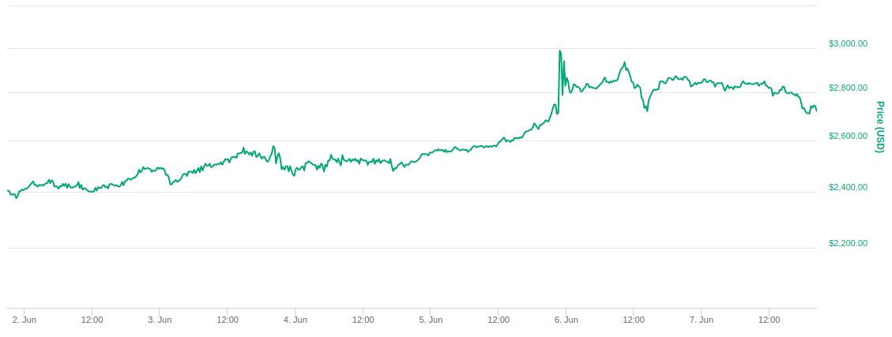
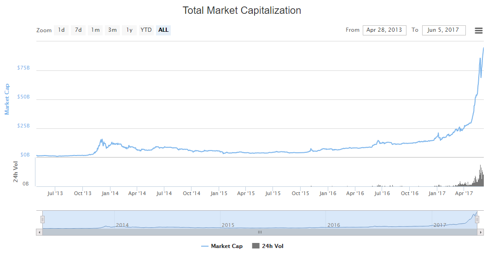

# <a name="fundamentacao">RESULTADOS</a>

## Índice

1. [Primeira semana de junho/2017](#primeira)
1. [Segunda semana de junho/2017](#segunda)
1. [Terceira semana de junho/2017](#terceira)
1. [Quarta semana de junho/2017](#quarta)

## <a name="primeira">Análise de preço na primeira semana de junho/2017</a>

Para melhorar a compreensão dessa análise, iremos analisar semanalmente o preço do Bitcoin durante o mês de junho/2017. Durante a primeira semana (01/06 até 07/06), tivemos um aumento no preço de 13,17%, iniciando a semana em 2,404.03 dólares e finalizando em 2,720.49 doláres. Em relação à variação máxima na semana, tivemos uma mínima de 2,375.87 dólares e uma máxima de 2,987.85 dólares, obtendo uma variação de 25,76%. Todos os dados acima podem ser consultados no CoinMarketCap. Confira abaixo o gráfico representativo dessa semana.

**Gráfico 4** – Preço do Bitcoin entre 01 e 07 de junho de 2017.

#### Fonte: CoinMarketCap.

Durante esta semana, tivemos algumas tensões internacionais, iniciando com a saída dos Estados Unidos da América (EUA) saindo do acordo de Paris, acordo que prevê que os países devem trabalhar para que o aquecimento fique muito abaixo de 2ºC, buscando limitá-lo a 1,5ºC em relação aos níveis pré-industriais (G1, 2017). Utilizando as cotações do Investing.com, nós podemos observar que o preço dólar, em relação ao Euro, caiu 0,63% nesse curto período. Durante o mesmo período, o _Bitcoin_ apresentou um aumento no seu preço, em relação ao dólar, de 5,46%.

O _Bitcoin_ por ser uma moeda que não tem vínculo com governos, acaba que por se sobressair em tensões internacionais deste tipo, atraindo investidores que buscam preservar o seu patrimônio em caso de queda nos preços das moedas tradicionais. No mesmo dia desse empasse político envolvendo os EUA e o acordo de Paris, o CEO da XBT Providers, uma das maiores exchanges de criptomoedas atualmente, publicou uma análise cravando que o _Bitcoin_ chegaria aos 4000 (quatro mil) dólares ainda ao final daquele ano (CNBC, 2017). O resultado disso, como podemos observar é uma crescente no preço do _Bitcoin_ nos 5 dias posteriores.

**Gráfico 5** – Alta crescente do Bitcoin nos primeiros 6 dias do mês de junho/2017.

#### Fonte: Investing.com.

Segundo dados do CoinMarketCap, em 5 de junho de 2017 a capitalização de mercado do _Bitcoin_ quebrou seu limite anterior e atingiu a estrondosa marca de 100 bilhões de dólares, como podemos observar no gráfico abaixo a capitalização disparou nos anos de 2016 e 2017, justificando a alta procura pela moeda. Apresentando novos horizontes ao _Bitcoin_, que agora já pode ser comparado à outros ativos de maior respaldo no mercado financeiro, chegando a valer mais do que a startup Uber (Startse, 2017).

**Gráfico 6** – Capitalização de Mercado do Bitcoin até junho de 2017.

#### Fonte: CoinMarketCap.