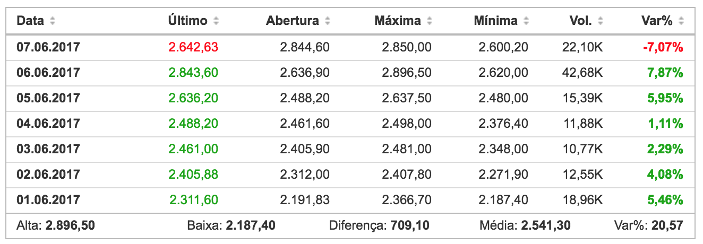
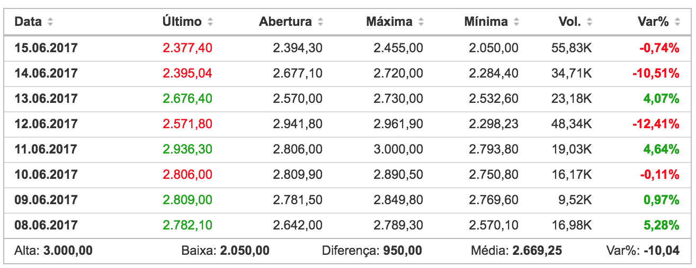
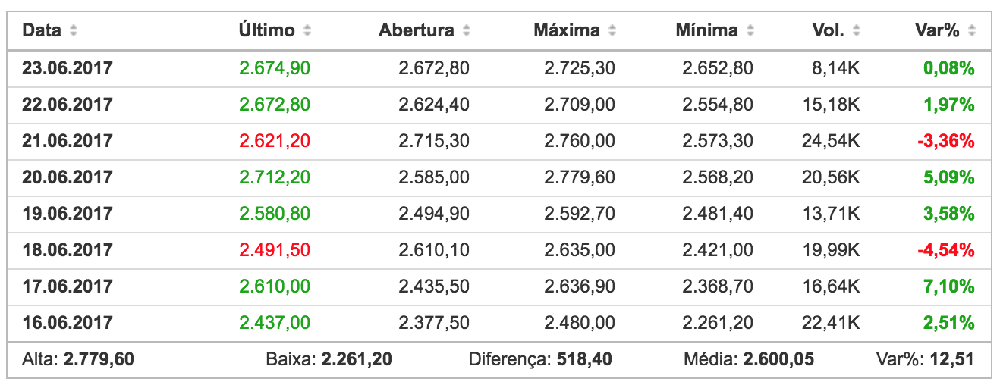
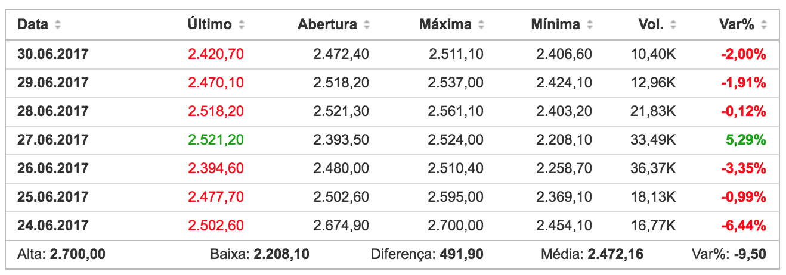

# <a name="introducao">CONCLUSÃO</a>

O objetivo desta pesquisa foi verificar até que ponto o preço do _Bitcoin_ no mês de junho de 2017, com cotações obtidas no CoinMarketCap e Investing, foi impactado por eventos externos, sejam eles relacionados diretamente ao _Bitcoin_ ou não. Com a finalidade de validar a metologia, utilizamos como aporte metodológico o Estudo de Eventos e o mapeamento do Fluxo Especulativo, cujo procedimento permitiu identificar pontos de influência de tensões informacionais no ativo _Bitcoin_, negociado no par BTC/USDnas casas de câmbio estrangeiras, durante o período de 01 de junho de 2017 até 30 de junho de 2017.

Na primeira janela de observação definida, a primeira semana de junho, definida entre 1 e 7 de junho, quando foi divulgado que os Estados Unidos saíram do acordo de Paris, fez com que o preço do dólar em relação ao euro despencasse 0,63%. Considerando o preço das do _Bitcoin_ no mesmo período, verificamos uma valorização de 5,46%. É importante ressaltar a relevância do impacto de uma notícia que diretamente não tem nenhuma relação com o _Bitcoin_, porém, se mostrou determinante para uma considerável alta diária.

**Gráfico 13** – Alta crescente do Bitcoin nos primeiros 6 dias do mês de junho/2017.

#### Fonte: Investing.com.

A segunda janela de observação, definida como o período entre 8 e 15 de junho, foi consideravelmente mais tranquila em termos de notícias e tensões internacionais, ocasionando uma estabilidade nos preços das criptomoedas. Há de se considerar, porém, que durante essa semana, houve a maior variação do mês, com as máximas e mínimas de preço ocorrendo nessa semana. É preciso salientar também, que nesta mesma semana, várias análises técnicas relacionadas ao _Bitcoin_ foram postadas, ocasionadas pelo grande marco que foi o preço da moeda atingir os 3,000 dólares.

**Gráfico 14** – Resumo semana entre os dias 8 e 15 de junho/2017.

#### Fonte: Investing.com.

Durante a terceira janela de observação definida, a terceira semana de junho, definida entre 16 e 23 de junho, ocorreram diversos ataques de vírus ransomwares pelo mundo, e esse tipo de vírus costumeiramente cobra o resgate da máquina em criptomoedas, desta forma, o _Bitcoin_ ganhou notável repercussão na mídia convencional, porém de forma negativa. Deste modo, muitos investidores decidiram retirar seus investimentos em _Bitcoin_, temendo uma associação leviana à sua fama, em razão disto, o fluxo migratório de _traders_ de _Bitcoin_ desceu bastante, com a maioria dos negociadores vendendo suas posições no mecado, causando uma queda vertiginosa nos preços.

**Gráfico 15** – Resumo semana entre os dias 16 e 23 de junho/2017.

#### Fonte: Investing.com.

Durante a última janela de observação definida, a quarta semana de junho, definida entre 24 e 30 de junho, ocorreu mais um ataque de vírus ransomwares, desta vez foi o vírus Petya que ganhou destaque, difamando ainda mais a fama das criptomoedas junto à comunidade global. Nesta semana ainda ocorreu a prisão de um operador de uma exchange ilegal, chamado Anthony Murgio, reforçando o viés marginal e criminoso das criptomoedas pela mídia.

**Gráfico 16** – Resumo semana entre os dias 24 e 30 de junho/2017.

#### Fonte: Investing.com.

Com esta pesquisa, esperamos ter contribuído para a fomentação do estudo de eventos no mercado financeiro por parte da Gestão da Informação, propondo uma metodologia passo-a-passo para identificar fatores externos que possam influenciar no ambiente interno de um ativo financeiro e principalmente sugerindo a criação de novas pesquisas com base nesta, buscando esclarecer os pontos ainda vagos, agregando valor à grande área da Ciência da Informação.